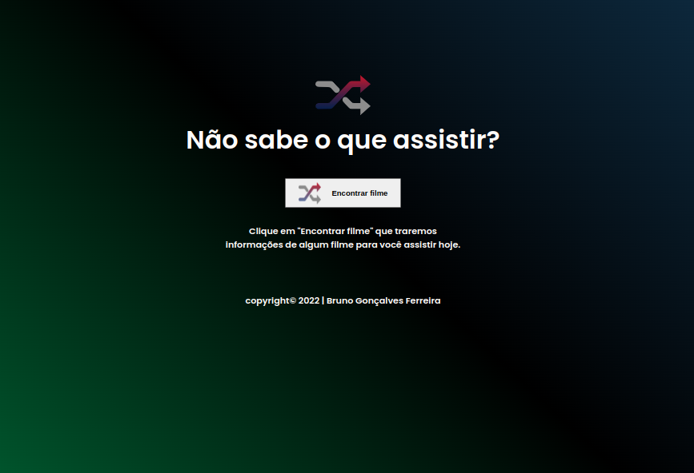
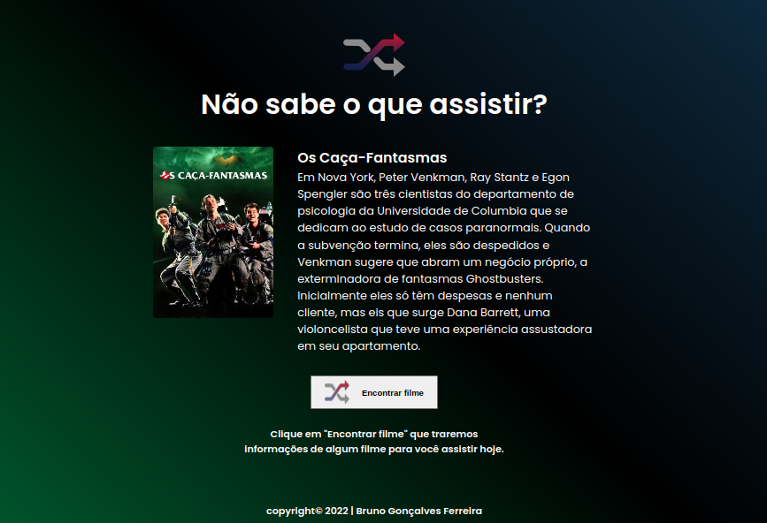

# Brflix

> Descrição

Projeto construido com o objetivo em dar uma sugestão de qual filme assistir.

  <a href="#-tecnologias">Tecnologias</a>&nbsp;&nbsp;&nbsp;|&nbsp;&nbsp;&nbsp;
  <a href="#-projeto">Projeto</a>&nbsp;&nbsp;&nbsp;|&nbsp;&nbsp;&nbsp;
  <a href="#-layout">Layout</a>&nbsp;&nbsp;&nbsp;|&nbsp;&nbsp;&nbsp;

 

## 🖼 Layout

[Clique aqui para acessar](https://brunogoncalvesferreira.github.io/NLWeSports/)

 

## 🚀 Tecnologias

Esse projeto foi desenvolvido com as seguintes tecnologias:

- HTML
- CSS
- JAVASCRIPT
- API The Movie DB
- GIT e GITHUB

 

## 💻 Projeto

Na aplicação conseguimos ter uma sugestão de filmes aleatórios, com base na API TheMovieDB. Usando Fetch Javascript conseguimos solicitar da API dados para o projeto funcionar.

 

## 🧑‍💻 Autor

<a href="https://www.instagram.com/brunogonferreira/">
 
  
 <b>Bruno Gonçalves Ferreira</b></a> <a href="https://github.com/brunogoncalvesferreira" title="Bruno Gonçalves Ferreira">🚀</a>
  

  

---

# br-flix
